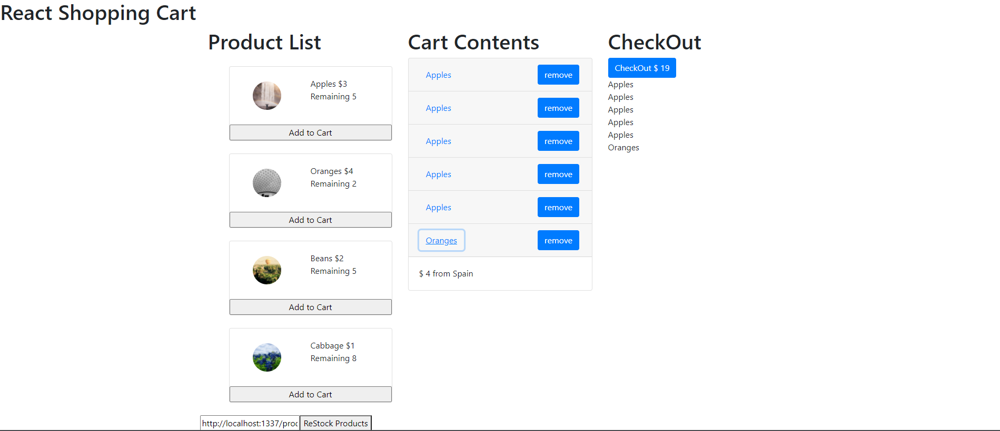

# Shopping-Cart-App

  

## Description:
  This program consists of jsx, and html.
  This program is the simple shopping app.
  
## Installation:
  1. Downloads each file into one file.  
    1. **index.html**  
    2. **cart.jsx**  
  
  
## Usage:
**[Live app](https://kojiroasano.github.io/Recomment-Movies/)**
  
  
## Support:
  If any question, message me via **[my twitter](https://twitter.com/Kojiro38895598)**.
  
## Roadmap:
  I am going to add css file, and also improve some functionality.
  
## License information: 
 If you use the part of this code in your program and show it to public, please include the name of ***MIT***. 
 API from [Strapi](https://strapi.io/)
 
